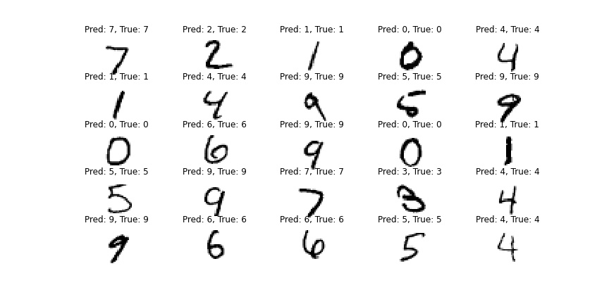
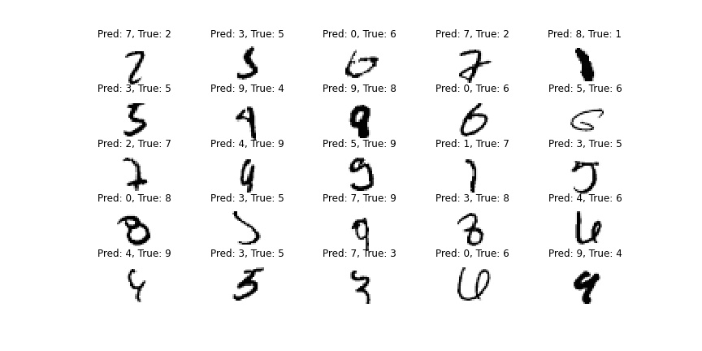
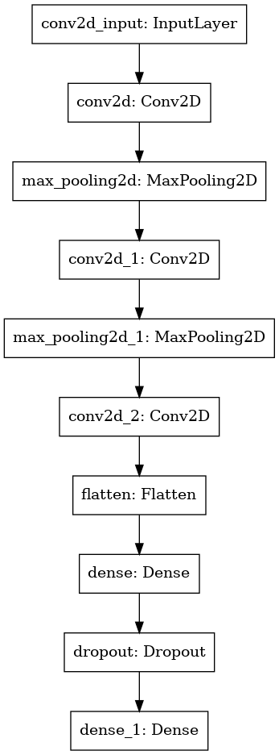

# Handwritten digits recognition with CNN
###### This project was completed in Week 9 of the Data Science bootcamp at SPICED Academy.
In this project I built a **Convolutional Neural Network** recognizing handwritten digits from the MNIST dataset. 
In a virtual environment I first built and trained a simple neural network with Keras. Then I created a more complex CNN by adding more convolutional layers and adjusting hyperparameters.
I was able to achieve 99.23% accuracy and decrease the loss to 2.6% on Test data.

**Correctly classified images:**

**Incorrectly classified images:**

**CNN architecture:**

